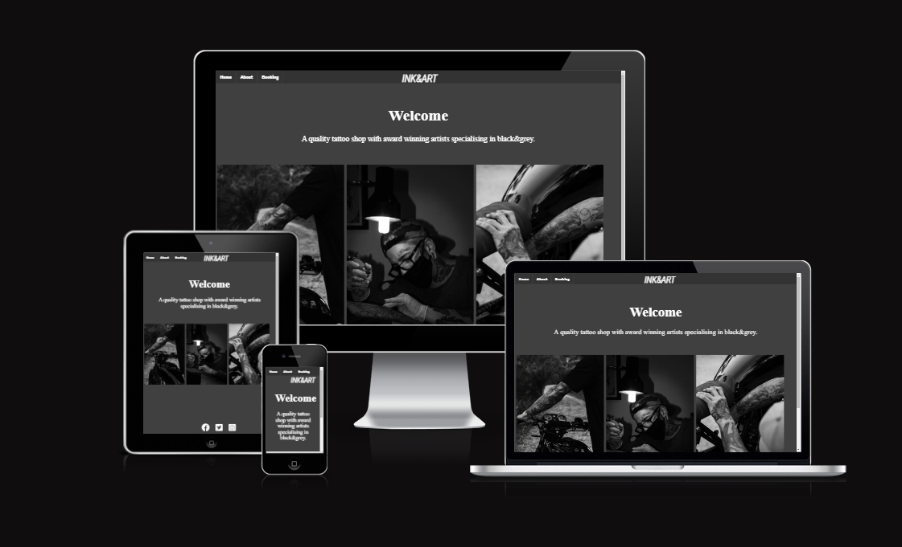
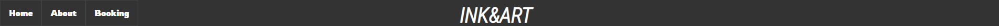
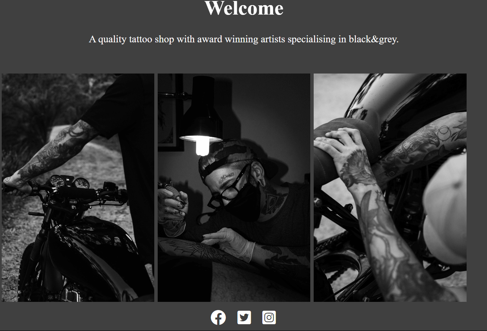
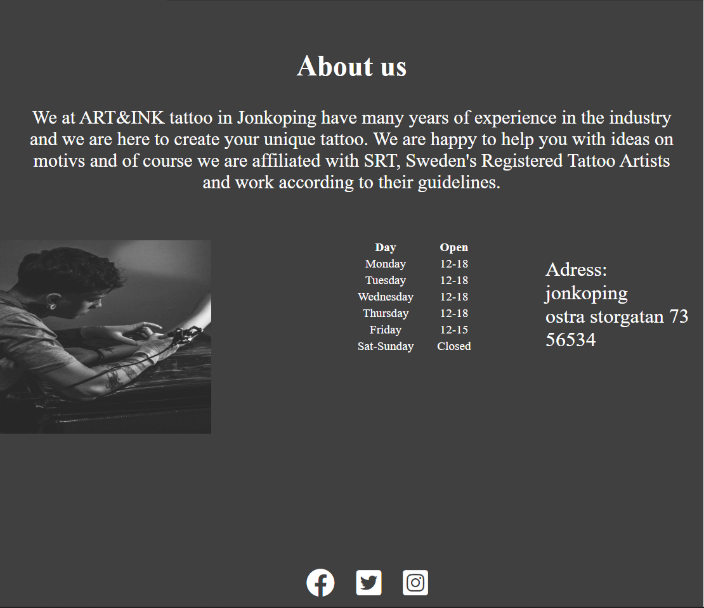
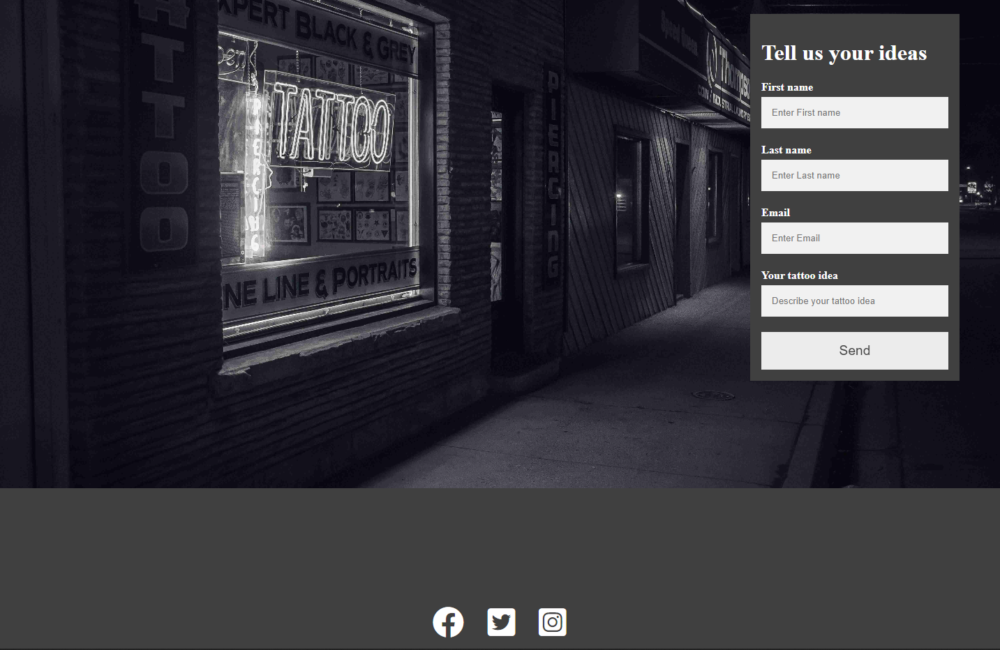
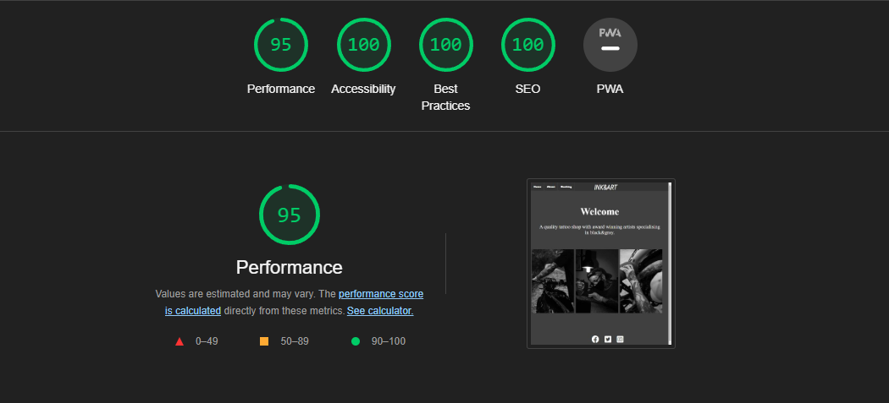
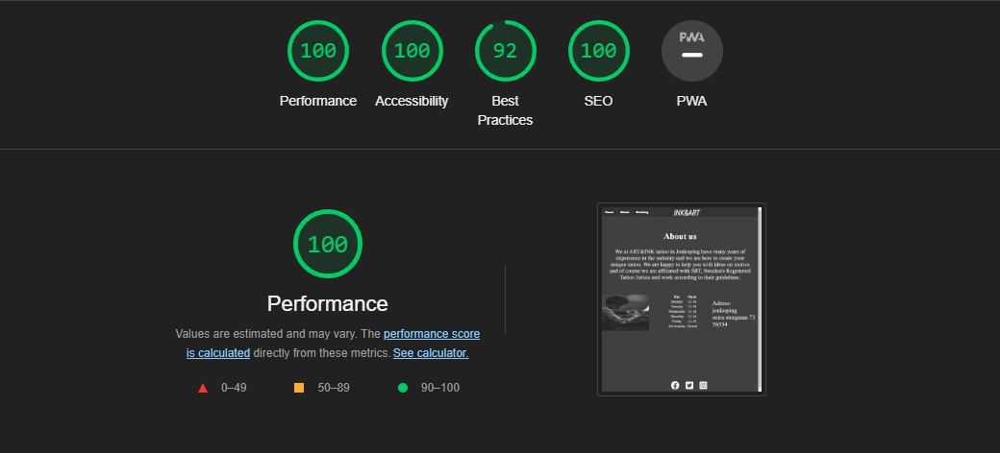
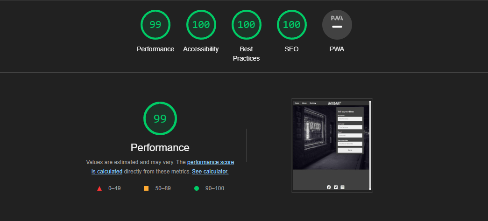

# INK&ART
   + The INK&ART website is a website for a tattoo shop. <br />
   + The users will find everything they need to know to book their first tattoo appointment: <br />
   + Adress ,socialmedia ,info about guidelines , booking form where the user can explain their tattoo idea. <br />
      <br />
# Features
 + Navigation
   + Featured at the top of the page, the navigation shows the tattoo shops name in the middle: INK&ART.
   + The other navigation links are to the left: Home, About, Booking which link to different pages.
   + The navigation is in a font to make it feel more like a tattoo shop, and a color that contrasts with the background.
   + The navigation is clear and makes it easy for the user to find the different sections of info. <br />
    <br />
# Home Page
 + Home
   + The home page welcomes the user.
   + Gives a quick information about the quality and the artists specialisation.
   + Shows pictures of tattoos and 1 artist in work to give users a little more understanding about the context.
   + Social media icons at the bottom so the user can look at artists previous work.
   + colors are white and grey so that users can easily spot: text, images and icons. <br />
    <br />
# About Page
  + About
    + The about page sticks to the simple layout.
    + Showcasing the tattoo shops guidelines in the header.
    + Showcasing one more artist in work. 
    + Shows open-closed times and the adress for the shop.
    + Social media icons at the bottom so the user can look at artists previous work.
    + colors are white and grey so that users can easily spot: text, images and icons. <br />
     <br />
# Booking Page
  + Booking
    + The booking page has a simple layout.
    + A big background image showing the studio.
    + A form that is easy to understand and read.
    + Gives the user a easy way to describe their tattoo idea, and the shop an easy way to pair up the right artist with the customer.
    + Social media icons at the bottom so the user can look at artists previous work.
    + colors are white and grey so that users can easily spot: text, images and icons. <br />
     <br />
# Testing
  + I tested that this page works in different web browsers: Chrome, Firefox, Safari.
  + I confirmed that this project is responsive, looks good and functions on all standard screen sizes using the <br /> devtools device toolbar.
  + I confirmed that the navigation, home, about, booking page are all readable and easy to understand.
  + I have confirmed that the form works: requires entries in every field, will only accept an email in the email field, <br /> and the submit button works.
# Bugs
  Solved bugs <br />
  + When i deployed my project to GitHub pages i discovered my project was broken, the links to the folders <br /> (images) did not work.
  + I discovered this was because i had used absolute file path such as this in my code:
    ```
    
# Validator Testing
  + HTML
    + No error were returned when passing through the official W3C validator.
  + CSS
    + No errors were found when passing through the official WC3 validator.
  + Accessibility
    + I confirmed that the colors and fonts are easy to read and accessible by running it through lighthouse in devtools.
     <br />
     <br />
     <br />
# Unfixed bugs 
  + No unfixed bugs.
# Deployment
  + The site was deployed to GitHub pages. The steps to deploy as follows:
    + In the github repository, navigate to the settings tab.
    + Click on pages in the drop-down menu.
    + On branch, select main! and save.
    + After a couple of seconds the page provides the link for the completed website.
# credits
## Content
   + The code to make the socials media links was taken from CI Love Running Project- CodeInstitute: https://codeinstitute.net/
   + Honorable mentions that have helped me understand different concepts: https://codeinstitute.net/ , https://www.w3schools.com/ , https://www.youtube.com/@WebDevSimplified
## Media
   + The images used in this project was taken from https://www.pexels.com/
 